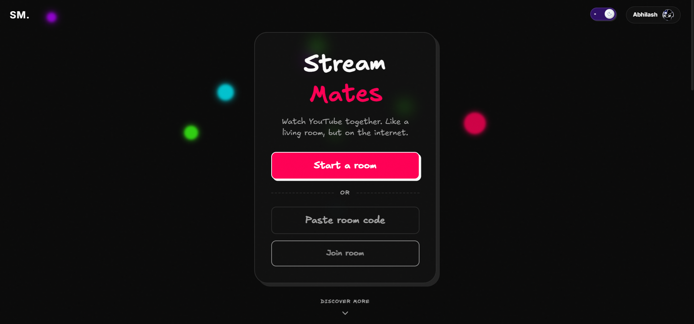
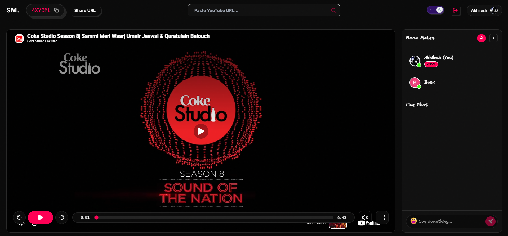
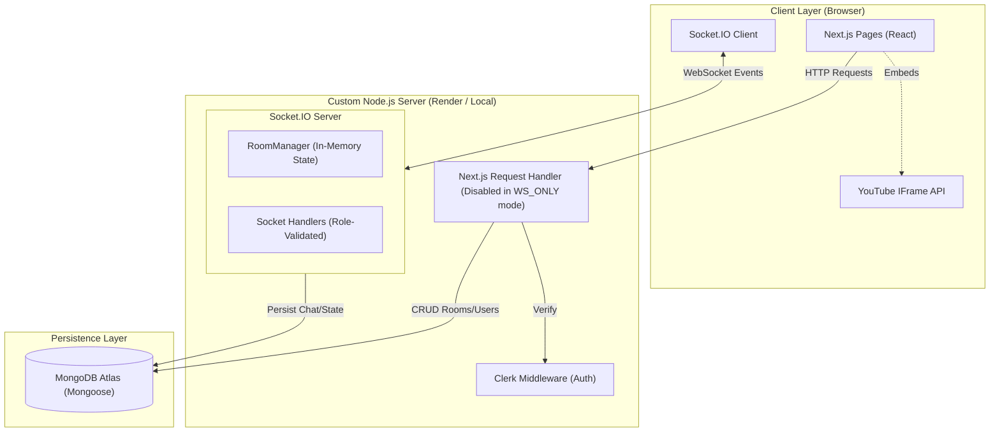
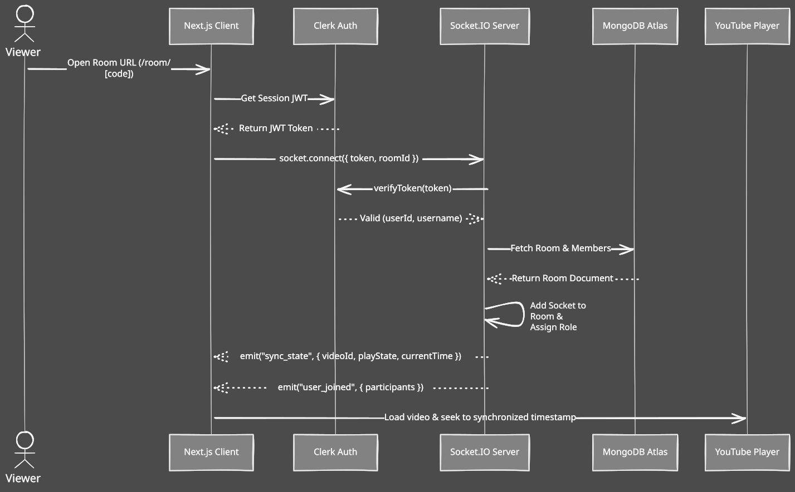
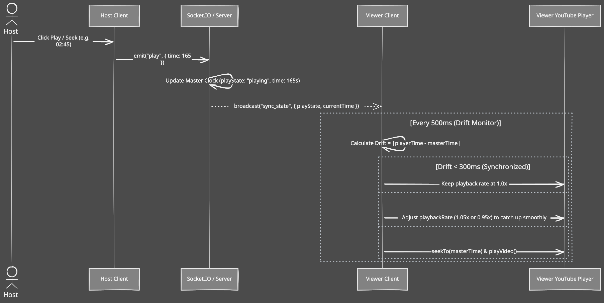
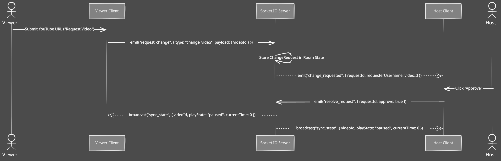

# Stream Mates — Real-Time YouTube Watch Party

<p align="center">
  <a href="https://skillicons.dev">
    
  </a>
</p>

A real-time YouTube watch party platform built with **Next.js 14**, **React 18**, **Socket.IO**, **MongoDB Atlas**, **Clerk Authentication**, and **Tailwind CSS**.

Watch YouTube videos with friends using synchronized playback, role-based controls, automated host succession, live chat, and floating emoji reactions.

---

## Live Deployment

- **Production URL** : *https://stream-mates-eta.vercel.app*
- **Repository** : *[Stream Mates](https://github.com/Shogun585/Stream-Mates)*

---

## Key Features

- **Synchronized Playback**: Master-clock alignment with continuous drift correction (adaptive speed adjustments for minor drifts, instant seek for desyncs).
- **Role-Based Permission Hierarchy**:
  - **Host**: Full playback control (Play, Pause, Seek, Load Video), promote/demote moderators, manual host transfer, kick participants, and change request reviews.
  - **Moderator**: Delegated playback controls and video request review capabilities.
  - **Participant / Viewer**: Synchronized viewing, video change requests, live chat, and emoji reactions.
- **Automated Host Succession**: When a host leaves or disconnects, ownership transfers to the senior moderator or next viewer in line.
- **Video Change Request Workflow**: Viewers can request YouTube videos; hosts and moderators can approve or decline in real time.
- **Live Chat with Deduplication**: Instant messaging with zero-latency optimistic delivery, unique message ID tracking, role badges, and MongoDB chat persistence.
- **100% Screen-Fit Responsive Layout**: Zero whole-page scroll design (`h-[100dvh] overflow-hidden`) with a dedicated tab switcher for Viewers and Live Chat on mobile devices, and multi-column view on desktop.
- **Dark & Light Mode**: Tailored HSL tokens, glassmorphism, and micro-animations.

---

## Screenshots

<div align="center">

### 1. Hero Page & Room Creation


### 2. Room Lobby & Video Player Controls


</div>

---

## Architecture Overview

The custom Node.js server runs both the Next.js frontend and the Socket.IO WebSocket server. Setting the `WS_ONLY=true` environment variable splits the architecture for production, allowing you to deploy the frontend to Vercel and the WebSocket server to Render.



### How WebSockets Integrate with the System Flow

1. **Authentication & Handshake**:
   - On room entry, the client fetches a fresh Clerk JWT session token.
   - The Socket.IO client connects to the server, where the JWT signature is verified with `@clerk/backend`, attaching the user's details to the socket connection.

2. **Room Subscription & State Hydration**:
   - The client emits `join_room { roomId }`.
   - The server registers the socket into the corresponding Socket.IO room channel (`io.to(roomId)`).
   - The server returns the active `syncState`, `participants`, and pending change requests directly to the client.

3. **Master-Clock Playback Sync**:
   - When the Host performs a playback action (Play, Pause, Seek), a WebSocket event is emitted (`play`, `pause`, `seek`).
   - The server validates the user's role.
   - The server updates the master playback state and broadcasts `sync_state` to all connected clients in the room in sub-100ms.

---

## Real-Time Sequence Diagrams

### 1. Connection, Authentication & State Hydration


### 2. Playback Control & Adaptive Drift Correction


### 3. Video Change Request & Approval Flow

---

## Modules

| Module / File | Technology | Purpose & Logic Overview |
|---|---|---|
| `src/server.ts` | Node.js `http` + Socket.IO | Custom server. Acts as a Next.js/Socket monolith locally, or as a WebSocket server in production via `WS_ONLY=true`. |
| `src/server/socket-handlers.ts` | Socket.IO | Initializes the WebSocket handlers and delegates role-validated event processing. |
| `src/server/room-manager.ts` | In-Memory Map | Tracks active `Room` instances in server memory. |
| `hooks/useSocket.ts` | `socket.io-client` | Manages WebSocket lifecycle, attaches event listeners, and connects to Vercel/Render URLs using `NEXT_PUBLIC_WS_URL`. |
| `components/room/YouTubePlayer.tsx` | React 18 + IFrame API | Video player frame with custom controls, scrubbing bar, volume/fullscreen handlers. |
| `components/room/Chat.tsx` | React 18 | Live chat panel with optimistic UI dispatch, unique message ID tracking, and role badges. |

---

## Role Permissions Matrix

| Capability | Host | Moderator | Participant |
|---|:---:|:---:|:---:|
| Play / Pause / Seek Video | Yes | Yes | No |
| Load New YouTube URL | Yes | Yes | No |
| Request Video Change | No | No | Yes |
| Approve / Reject Change Requests | Yes | Yes | No |
| Promote to Moderator | Yes | No | No |
| Demote to Participant | Yes | No | No |
| Kick / Remove Viewers | Yes | No | No |
| Transfer Host Privileges | Yes | No | No |
| Live Chat & Emoji Reactions | Yes | Yes | Yes |

---

## Setup & Run Instructions

### 1. Prerequisites
- **Node.js**: v20.x or higher
- **MongoDB Atlas**: A MongoDB database connection URI
- **Clerk Account**: For user authentication keys ([clerk.com](https://clerk.com))

### 2. Clone & Install Dependencies

```bash
cd Stream_Mates
npm install
```

### 3. Environment Variables Configuration

Create a `.env.local` file by copying the example:

```bash
cp .env.example .env.local
```

```env
# Clerk Authentication
NEXT_PUBLIC_CLERK_PUBLISHABLE_KEY=pk_test_...
CLERK_SECRET_KEY=sk_test_...

# Database (MongoDB Atlas)
MONGODB_URI=mongodb+srv://<username>:<password>@cluster0.mongodb.net/?retryWrites=true&w=majority

# Production WebSocket Routing (Required on Vercel frontend)
NEXT_PUBLIC_WS_URL=https://your-render-url.onrender.com

# True Split Architecture (Required on Render backend)
WS_ONLY=true
```

### 4. Running Locally

#### Development Mode (with Live Hot-Reloading & WebSockets):
```bash
npm run dev
```
Open [http://localhost:3000](http://localhost:3000) in your browser.

#### Production Build & Execution:
```bash
npm run build
npm run start
```

---

## Available Scripts

| Script | Command | Purpose |
|---|---|---|
| `dev` | `ts-node src/server.ts` | Starts the custom development server with hot-reloading for both Next.js and WebSockets |
| `build` | `next build` | Generates the optimized Next.js production build |
| `start` | `NODE_ENV=production TS_NODE_TRANSPILE_ONLY=true ts-node src/server.ts` | Runs the compiled production Node.js + Socket.IO server (bypassing heavy TS parsing) |
| `lint` | `next lint` | Executes ESLint static code analysis |

---

## Author

This project was authored by [Abhilash Singh](https://github.com/Shogun585) better known as Shogun585.